# DINOv3_vits16

## 512 样本

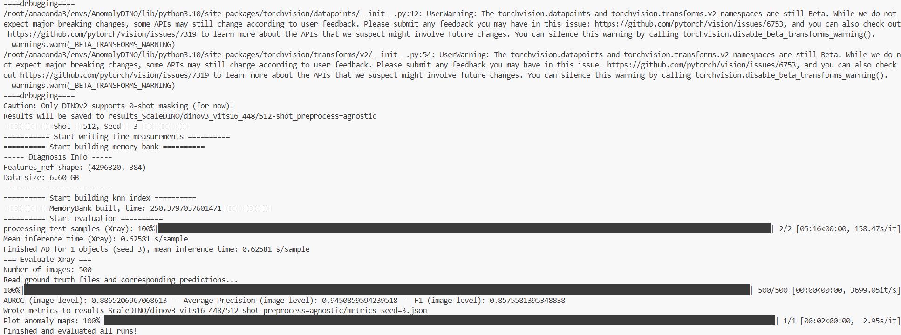

# 1024 shots， 364分辨率

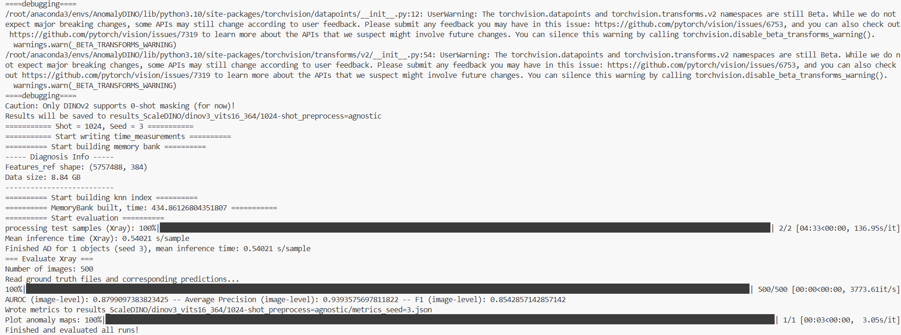

# DINOv3_vitb16

## 64 样本（混杂了一些未预处理的图片）

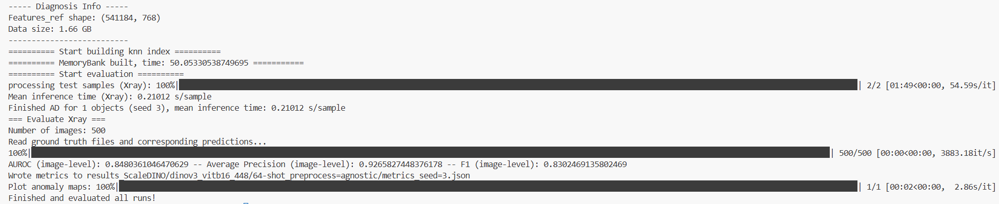

## 64样本

## 128 样本（分辨率560）

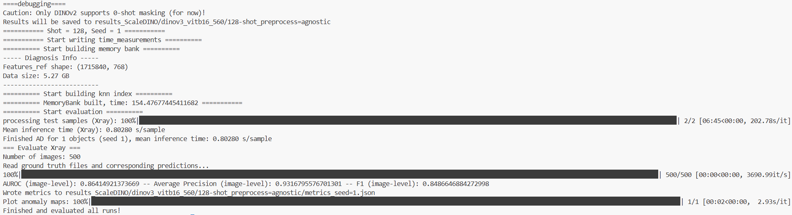

## 256 样本（混杂了一些未预处理的图片）

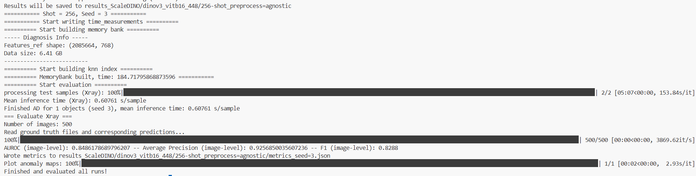

## 256 样本

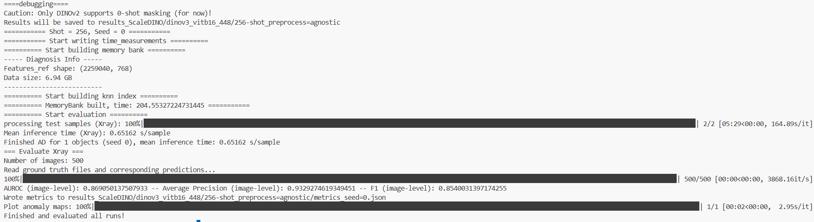

# 512 样本，378 分辨率

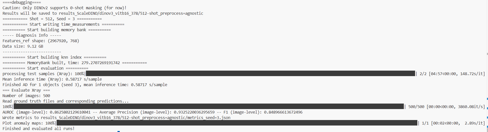

# DINOv3_Vitl16

## 64 样本

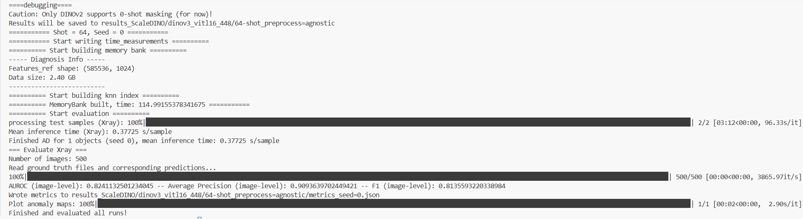

## 128样本

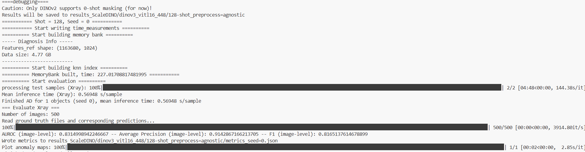

# DINOv3_convnext_base

## 128 样本，560 分辨率

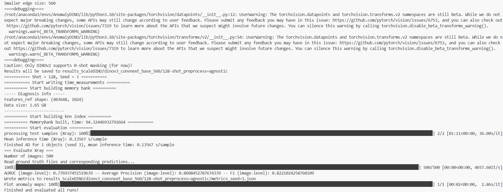

## 512 样本，630 分辨率

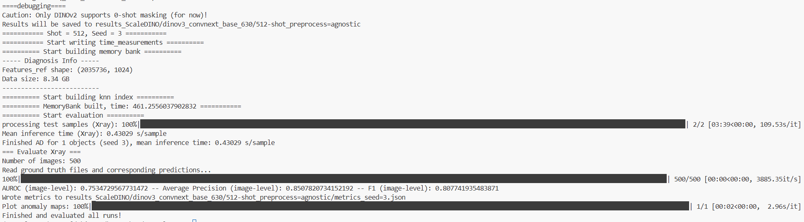

## 512 样本，560 分辨率

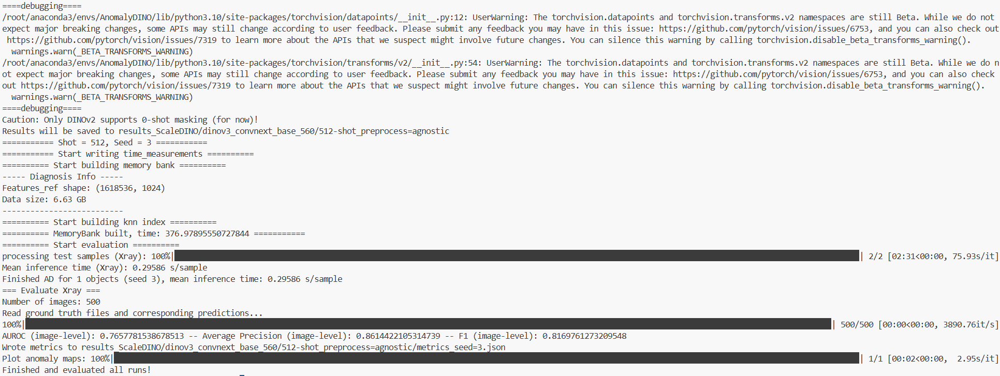
