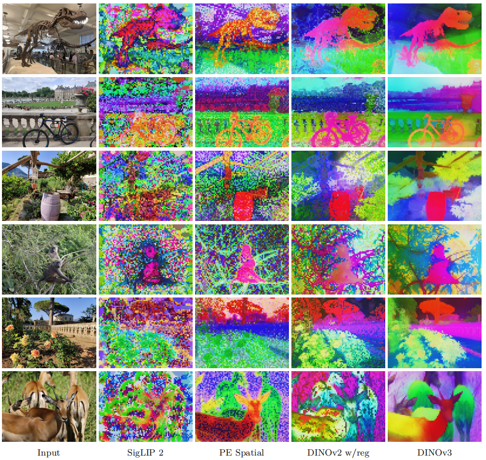

## DINO v2 瓶颈

**密集特征(局部、像素级特征)退化：**在长时间训练大参数量的模型时，高层语义理解和底层密集特征会发生冲突，导致后者崩溃

## Training at Scale Without Supervision

通过将模型和数据集大小提升一个数量级，产生通用、无偏见的视觉特征。

### 数据准备

从 Instagram 上先搜集了 170 亿张原始图片，并以此为基础构建了由三个部分组成的数据集。

1. 第一部分通过 DINOv2 提取特征，利用 k-means 进行聚类，得到数据池中所有图片类别。通过在数据中平衡采样，可以得到大约17亿张图片
2. 第二部分基于检索。先选定一些种子训练集，对于这些种子集中每张图片，在 170 亿的数据池中检索与之最相近的几张图片。
3. 第三部分加入了高质量的公开数据集， 如ImageNet1k。

**混合批次训练：**

每一次迭代中，10% 概率只在 ImageNet1k 上进行训练，90% 概率只接收来自其它数据源的异质化批次

### Large-Scale Training with Self-Supervision

**损失函数：**

综合 DINO loss，iBOT loss，以及Koleo 正则化

**模型架构更新**

1. RoPE位置编码，引入了 RoPE-box jittering: 在训练中，随机地缩放位置坐标的范围。
2. 提升了模型的参数量。

**optimization**

采用恒定的学习率、恒定的权重衰减和恒定的教师EMA动量

## Gram Anchoring

当 cls token 和 patch token 之间的模型相似度较低时，模型的分割性能较高。

随着训练的进行，cls token 越能代表整张图片即与各个图像块token 总余弦相似度越高，此时各个图像块 token 也趋同，即蕴含更多全局信息，而损失了局部信息。

### Gram 算法

核心思想是：加入一个新的 loss，这个 loss 不干预特征本身，但是要保证特征之间的相似性结构保持稳定。

**Gram 矩阵：**保存了图像中每一个块和其它块的相似度。新的目标即为让学生模型去模仿老师输出的 Gram 矩阵，这个老师即为学生训练较早时，密集特征尚未下降时的模型。

这个新损失函数在模型迭代了 100万次后才引进，称为**精炼阶段**。

### Leveraging Higher-Resolution Features

在精炼阶段，将高分辨率的图片输入进 Gram 老师网络，得到一张高分辨率的特征图，再通过降采样使得该特征图与学生网络输出的特征图尺寸一致。

## Post-training

### 分辨率扩展

在训练的每个小批次中，不使用固定大小的图像块，而是随机采样不同尺寸的图像块。

#### Model distillation

使用训练好的、参数固定的 ViT-7B 模型作为教师，学生用模型参数较小的vit模型。

损失函数和DINOv3 的训练的第一阶段相同，不用引入Gram 阶段。

#### 图文对齐

提取能代表全局特征的 cls token，再将所有图像块特征进行平均池化，将两者拼接起来，得到一个既有全局信息又有局部信息的视觉表征。

冻结 DINO v3，准备一个文本编码器，用对比学习的方法，从头训练它。

## Results

### 视觉特征提取

#### Qualitative Analysis

在数据特征提取上 DINOv3 已经超过其它对手：

#### Dense Linear Probing

冻结 DINO v3 主干网络，只在该模型输出的特征基础上，训练一个线性分类层。

**语义分割：** 

给图像中每一个像素点打标签，评测指标：mIoU (平均交并比)

在通用的 ADE20k 数据集上，DINOv3 的得分比其他自监督模型 **高出超过 6 个 mIoU 点** ，比弱监督模型 **高出超过 13 个点** 。甚至超越了 PEspatial 和 AM-RADIOv2.5 这两个专门从为分割而生的 **SAM 模型** 中“蒸馏”知识而来的模型。

**单目深度估计**

通过单张图片来预测每个像素点的远近。

DINOv3 **再次大幅领先**所有其他模型

#### 3D 对应点估计

模型能否理解图片中物体在不同视角下的位置。

具体任务：

1. 几何对应：在同一物体的不同图片中，找到同一关键点位置
2. 语义对应：在同类但不同个的物体的照片中，找到功能相同的关键点

无论是在几何对应还是语义对应任务上，DINOv3 的表现都超过了所有其他模型，并且显著优于其前代 DINOv2

#### Unsupervised Object Discovery

在没有任何人工标注的情况下，圈出图片中所有物体。实验基于 TokenCut 的算法，计算图中所有小块的特征相似度，将特征相近的小块聚合从而发现物体轮廓。

**DINOv2 **: 一尽管 DINOv2 在像素级的分割、深度估计任务上很强，但它在无监督对象发现这个任务上却 **意外地失败了** 。论文作者认为，这可能是因为它生成的特征图中存在较多的**伪影和噪声，正如第一个可视化实验所展示的**

DINOv3 凭借其**干净、精准**的特征图，不仅解决了 DINOv2 的问题，而且**全面超越了包括初代 DINO 在内的所有对手**

#### Video Segmentation Tracking

测试模型的时间一致性，判断其对物体的理解是否会随着时间而改变。

给定一个物体的分割蒙版，模型是否能在后续帧中追踪出这个物体？算法：新的一帧的图片中，对于每一个像素，寻找上一帧中特征最相近的像素，然后复制其标签。

**特殊设置** : 实验在三种不同的输入分辨率（低、中、高）下进行，以测试模型处理高分辨率视频的能力。

**INOv3 在所有分辨率下都表现最佳** : 它不仅全面超越了所有对手，而且在高分辨率（L）下的优势尤其惊人，在 DAVIS 数据集上比 DINOv2  **高出整整 6.7 分** ，这是一个巨大的飞跃。

#### Video Classification

模型能否判断出一段短视频的核心内容是什么？

用 DINO v3 独立地提取出视频每一帧的稠密特征，在这些特征之上训练一个 4 层的 Transformer 分类器。

**DINOv3 极具竞争力** : 尽管在这个更复杂的设置中，模型间的差距有所缩小，但 DINOv3 的表现与强大的弱监督模型（PEcore, SigLIP 2） **处于同一梯队** ，并且明显优于 DINOv2 等其他模型。

### Global Image Descriptors

#### 图像预测

在代表全局信息的 **`CLS` 令牌**之上，训练一个简单的线性分类器

1. 在标准 ImageNet 上训练，在域外测试集上测试（包括风格化图片、损坏的图片）
2. 区分非常相似类别的能力

在图像分类这个传统上被认为是（弱）监督学习“主场”的领域，DINOv3 作为 **第一个自监督模型** ，取得了与最顶尖的弱监督模型（SigLIP 2, PE）和监督模型（ViT-22B）相媲美的成绩。

DINOv3 在所有细粒度分类任务上，都优于之前的自监督方法。

#### Instance Recognition

以图搜图，根据一张图片中的一个物体，找出数据库中同样包括这个相同物体的图片

对数据库中的图片，用 DINOv3 提取包含全局信息的 cls 令牌特征。

给定一张图片，同样提取它的 cls token，计算两者余弦相似度。

将数据库中的图片按余弦相似度从高到低排序。

**DINOv3 以巨大优势获胜** : 在所有评测基准上，DINOv3 的性能都遥遥领先。例如，在 Met 数据集上比第二名 DINOv2  **高出 10.8 个点** ，在最具挑战的 AmsterTime 上 **高出 7.6 个点** 。在检索任务中，这是压倒性的优势。

### Foundation Model

#### Object Detection

要求模型在一张图片中同时完成 **定位** （画出物体的边界框）和 **识别** （判断物体类别）。

 **核心方法** :

1. **冻结 DINOv3 主干** : 在整个训练过程中，DINOv3 的核心参数保持不变。
2. **训练轻量解码器** : 只训练一个相对较小的检测解码器（Plain-DETR，约1亿参数）来学习如何利用 DINOv3 提供的特征完成检测任务。

**以更小的代价达到 SOTA** : 实验结果显示，这个“ **冻结的 DINOv3 + 轻量解码器** ”的组合，成功达到了**业界顶尖 (SOTA)** 的性能。

#### Semantic Segmentation

为图中每一个像素都分配一个类别标签。实现像素级别的“填色游戏”，将图中所有属于“车”的像素标为蓝色，所有属于“树”的像素标为绿色，等等。与目标检测不同，这里不需要区分“车1”和“车2”。

冻结主干 + 训练解码器

**性能追平 SOTA** : 基于**冻结 DINOv3** 的分割模型，在权威的 ADE20k 数据集上达到了 **63.0 mIoU** 的分数， **追平了当时最先进的（SOTA）模型 ONE-PEACE** 。

#### Monocular Depth Estimation

采用该领域 SOTA 模型 **Depth Anything V2 (DAv2)** 的框架，本实验**将 DINOv2 主干替换为 DINOv3** ，看效果如何。

基于**冻结 DINOv3** 的深度估计模型在 **5 个真实世界数据集**的零样本（zero-shot）测试中，几乎全面 **刷新了 SOTA 记录** 。

#### Visual Geometry Grounded Transformer

他们采用了 **VGGT** 模型，这是一个强大的 3D 视觉基础模型，能够通过一次前向传播，就估算出场景的所有关键 3D 属性（如相机内外参数、深度图、点云等）。**将主干网络替换为 DINOv3** 。

## Evaluating the Full Family of DINOv3 Models

在权威的 ADE20k 分割任务上，DINOv3 ViT-L 模型比最强的对手 DINOv2  **高出超过 6 个 mIoU 点** 。ViT-B 模型也高出约  **3 个 mIoU 点** 。

他们直接比较了最大的学生模型（ViT-H+）与 8 倍于其大小的 70 亿参数教师模型的性能。 实验显示，最大的学生模型 **达到了与庞大的教师模型“不相上下 (on par with)”的性能水平** 。

### ConvNeXts

ConvNeXt 在计算效率（FLOPs，即浮点运算次数）上表现优异，运行速度快

大量现有的硬件（如GPU、各种AI加速芯片）对**卷积运算**有深度的优化，部署卷积网络通常比部署 Transformer 更成熟、更高效。

**分类任务**

随着分辨率提高，性能提升

**稠密任务**

DINOv3-CNX 模型在分割任务上取得了惊人的巨大提升。

### 基于 dino.txt 的零样本推理

训练一个 **文本编码器** ，并让它的输出与预训练好的 DINOv3 ViT-L 视觉模型的输出在特征空间中 **对齐 (align)** 。

* **全局对齐 (Global Alignment)** : 将描述整张图片的文本（例如，“一张狗在草地上奔跑的照片”）与 DINOv3 的全局特征（`CLS` 令牌）对齐。这主要用于**图像分类**和**图文检索**任务。
* **局部对齐 (Patch-level Alignment)** : 将描述图片中某个物体的词语（例如，“狗”或“草地”）与 DINOv3 对应区域的**图块（patch）特征**对齐。这是实现 **开放词汇分割** （用任意文字来指导分割）等稠密任务的关键。

基于 DINOv3 的图文模型，在所有基准测试上的表现都**显著优于**基于 DINOv2 的版本。这证明了拥有一个更强的视觉主干是提升多模态能力的基础。

## DINOv3 on Geospatial Data

为了证明 DINOv3 的自监督学习“配方” **是通用的** ，不仅仅适用于我们日常所见的网络图片，也能在数据特性截然不同（例如，上帝视角、传感器噪声、物体纹理差异巨大）的卫星图像领域取得成功。

为此，他们以下方法：

1. **训练一个全新的“DINOv3 卫星版”模型** ：他们使用了一个包含 **4.93亿张** 卫星图像的庞大数据集（SAT-493M），从头开始训练了一个 70 亿参数的 DINOv3 模型。
2. **保持配方不变** ：为了证明其普适性，他们几乎**完全沿用了**训练网页版模型时的那套超参数和训练流程，只对最基础的图像归一化参数做了适配。
3. **进行对比** ：他们将这个新的“ **DINOv3 卫星版** ”与原始的“ **DINOv3 网页版** ”以及其他地球观测领域的顶尖模型，在多个专业任务上进行了全面对比。

### 实验一：树冠高度估计

* **“DINOv3 卫星版”刷新了 SOTA 记录** ：在多个基准测试中，使用卫星数据预训练的模型都取得了最佳性能，显著降低了测量误差。这直接证明了 DINOv3 的训练方法可以被成功地“开箱即用”到新领域。
* **蒸馏出的学生模型同样出色** ：由 7B 教师模型蒸馏而来的 ViT-L 学生模型，性能与其庞大的老师不相上下，甚至在某个测试集上表现更优，再次验证了蒸馏的有效性。
* **领域预训练的优势** ：“DINOv3 网页版”虽然也表现不错，但明显落后于“卫星版”。这说明，对于 **高度依赖物理信息和传感器特性的度量任务** ，在特定领域的数据上进行预训练是至关重要的。

### 实验二：对比地球观测领域的 SOTA（语义理解任务）

* **DINOv3 模型大获全胜** ：无论是“卫星版”还是“网页版”，**冻结的 DINOv3 主干**在 15 个任务中的 **12 个**上都创造了新的 SOTA 记录，击败了包括 Prithvi-v2 和 DOFA 在内的许多专门为地理空间数据设计的、使用了更多光谱波段和任务微调的复杂模型。
* **最大的惊喜：“DINOv3 网页版”极具竞争力，甚至更优** ：出人意料的是，在许多语义分割和目标检测任务上，使用通用网页数据训练的“DINOv3 网页版”表现得 **与“卫星版”一样好，甚至更好** 。它在 LoveDA 和 DIOR 这两个高分辨率分割和检测基准上都取得了最佳成绩。
