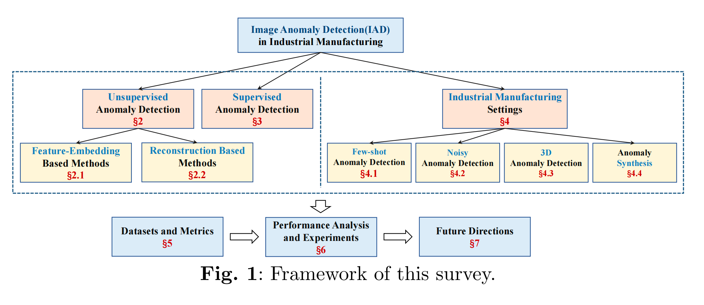
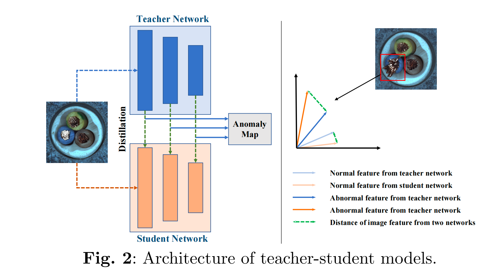
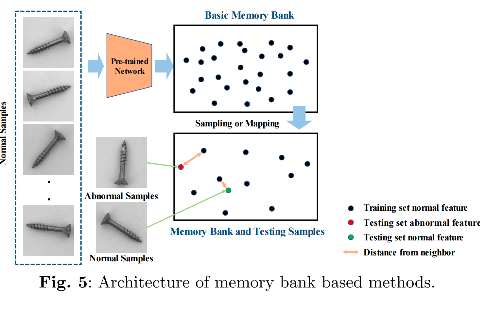

# Unsupervised AD

AD in industrial images is a subset of problems of OOD, which is a broader term for identifying data poins coming from a different distribution than the one the model is trained on.

## Feature-embedding based Methods

### Teacher-Student architecture

**教师模型：**

在一个大型数据集上预训练好的模型，参数固定不变

**学生模型：**

与教师模型结构相似，但更轻量，它用于学习教师提取特征。

**训练阶段：**

训练数据全部都是正常的图像。

输入一张图像，教师会输出一张特征图，训练的目标是让学生模型输出的特征图与教师相似。

**推理阶段：**

当输入正常图像时，学生生成的特征图和教师生成的会很相似。

当输入异常图像时，由于学生没有学习过，输出的特征图与教师生成的会有很大差异。

然后将学生模型输出的特征图和教师输出的特征图进行比较，得到一个“异常得分图"（Anomaly Map）。

差异越大的地方，异常得分越高。将差异图缩放到与原图同样的尺寸，就能得到清楚知道图片哪一个部位得分最高，**从而实现对异常区域的精确定位**。

### One-class Classification

模型把异常鉴别当成一个特殊的分类任务。

**训练阶段：**

模型会学习正常图片数据的特征，在特征空间中，找到一个尽可能紧凑的边界能将全部的特征点包围起来，这个边界称为“超球面”.

**挑战：**

由于训练时用的数据都是正常图片，很难找到一个合适的边界。

常见的对策就是人工生成异常数据。

### Distribution-based methods

**训练阶段：**

首先用一个预训练好的大模型提取出图片的特征。

然后在正确图片数据集上，训练一个映射模组，将提取出的特征映射到一个指定分布上，这个分布通常是多元正态分布。

**推理阶段：**

当输入一张图像时，首先提取其特征，然后用已经训练好的映射模组进行变换。

当输入正常数据时，变换得到的分布应该接近指定分布。

当输入异常数据的时候，变换得到的分布肯定与 MVD 有巨大偏差。

通过量化这个偏差便可以得到图片为异常的概率。

#### Normalizing Flows

通过一系列连续的、可逆的映射函数，将一个简单的概率分布映射成一个复杂的目标分布。

在异常检测应用当中，则是采用其逆过程，将未知的特征分布映射成已知的多元高斯分布

### Memory Bank

**构建内存库：**

用一个预训练好的网络来处理大量的正常图像，从中提取出正常图像的特征向量，将这些特征向量采样或者映射后存储在内存库中，称为"Memory Bank"。

**推理过程：**

输入图像，用同一个预训练网络提取出其中特征，将这些特征与内存库中所有特征进行比较。

通过计算这些新特征与内存库中“最相似的特征向量”的空间距离来量化其异常程度。

## Reconstruction-Based Methods：

它的目标是训练一个网络可以将输入的图片可以重构成正常图片。

**训练阶段：**

将正常图像（或人工构造的异常图片）输入到重构网络中，目标是使得输入与输出尽可能的相似。

通过衡量 “输出图像和输入图像之间的差异” 来构建“重构损失函数”。

训练的最后结果是，这个网络非常擅长对正常图像的低误差重建。

**推理阶段：**

将图像输入训练好的网络，得到一个重构好的图像。

如果是正常图像，重构出来的图像应该和输入的图像差异很小。

如果是异常图像，由于网络只知道如何重构正常图像，因此它会修正异常图像的瑕点，最终得到的图像会和原来输入的有差异。

构建一个对比模型，在像素级别上对比输入与输出的图像的差异，即可**实现像素级的异常部位检测**。

# Supervised AD

获取了少量的带有标签的异常数据。

## Semi-supervised AD

1. 利用训练动态：通过比较异常图像和正常图像的损失值下降差异。如：利用强化学习构建一个采样器放大训练过程中损失值的变化。
2. 注意力引导：在训练过程中，构建一个“引导注意力损失函数”，利用少量异常数据引导模型学会只关注正常部分，而抑制异常部分。
3. 高价值标注：利用像素级别的标签，性能也能达到全监督学习级别。
4. 设计专门的损失函数，专门应对数据不平衡的情况。
5. 解耦表示学习：通过学习将不同类型的异常特征分离开，提高模型的泛化能力。

## Fully-Supervised AD

1. 视为目标检测：把目标和缺陷当成一个个目标物体，模型最后训练的结果需要给出边界框
2. 视为语义分割：模型需要对每个像素进行分类，判断其是否是“异常”还是“正常背景”。
3. 视为显著性检测（saliency detection）：将图像中的异常视为显著部分，并用显著性算法去检测它们。
4. 视为多类别分类：当异常有多个类别时，直接训练一个分类器用来识别图像有哪一类或哪些量的异常。

# Industrial Manufacturing Setting

## Few-shot AD

其核心目的有两个：

1. 降低成本
2. 研究哪一类数据对模型的影响最大

该领域目前还处于起步阶段。

### 元学习 Meta-learning

通过在一个与异常检测无关的大型数据集上训练一个模型，使得该模型具备非常强的适应能力。

### Zero-shot AD

利用超大型的预训练模型强大的通用知识和泛化能力，在无需任何针对性训练的情况下实现对异常部分的检测。如：

1. MAEDAY: 使用一个预训练好的掩码自编码器 MAE。输入图像，随机遮蔽一部分区域，让MAE还原图像。如果还原的图像与原来差异较大，则说明有异常。
2. WinCLIP: 使用强大的视觉-语言模型CLIP。输入图像和文本（一张有损坏物体的图像），然后计算文本与图像的相似度。

# Total Performance Analysis

1. **Memory Bank：** 在图像级别识别上性能最好。
2. **Reconstruction：** 在像素级别识别上性能最好。能精确识别出异常区域边界。
3. U-Net 有巨大价值
