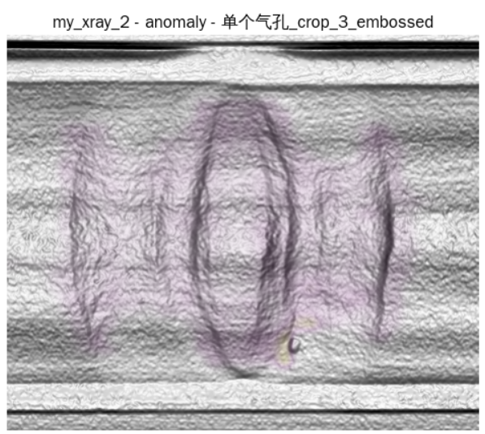

# 论文阅读

阅读了三篇论文，从第一篇综述中了解了 Industrial images Anomaly Detection 的主要方法；第二篇和第三篇介绍了 AnomalyDINO, PatchCore 这两种 MemoryBank 模型

## Deep Industrial Image Anomaly Detection: ASurvey

### Teacher-Student architecture

**教师模型：**

在一个大型数据集上预训练好的模型，参数固定不变

**学生模型：**

与教师模型结构相似，但更轻量，它用于学习教师提取特征。

**训练阶段：**

训练数据全部都是正常的图像。

输入一张图像，教师会输出一张特征图，训练的目标是让学生模型输出的特征图与教师相似。

**推理阶段：**

当输入正常图像时，学生生成的特征图和教师生成的会很相似。

当输入异常图像时，由于学生没有学习过，输出的特征图与教师生成的会有很大差异。

然后将学生模型输出的特征图和教师输出的特征图进行比较，得到一个“异常得分图"（Anomaly Map）。

差异越大的地方，异常得分越高。将差异图缩放到与原图同样的尺寸，就能得到清楚知道图片哪一个部位得分最高，**从而实现对异常区域的精确定位**。

### One-class Classification

模型把异常鉴别当成一个特殊的分类任务。

**训练阶段：**

模型会学习正常图片数据的特征，在特征空间中，找到一个尽可能紧凑的边界能将全部的特征点包围起来，这个边界称为“超球面”.

**挑战：**

由于训练时用的数据都是正常图片，很难找到一个合适的边界。

### Distribution-based methods

**训练阶段：**

首先用一个预训练好的大模型提取出图片的特征。

然后在正确图片数据集上，训练一个映射模组，将提取出的特征映射到一个指定分布上，这个分布通常是多元正态分布。

**推理阶段：**

当输入一张图像时，首先提取其特征，然后用已经训练好的映射模组进行变换。

当输入正常数据时，变换得到的分布应该接近指定分布。

当输入异常数据的时候，变换得到的分布肯定与 MVD 有巨大偏差。

通过量化这个偏差便可以得到图片为异常的概率。

#### Normalizing Flows

通过一系列连续的、可逆的映射函数，将一个简单的概率分布映射成一个复杂的目标分布。

在异常检测应用当中，则是采用其逆过程，将未知的特征分布映射成已知的多元高斯分布

**基于高斯分布建模的方法**

假设从预训练网络中提取出的 **正常样本的特征，服从一个多元高斯分布** 。

利用上一步得到的特征向量集合，计算出它们的**均值向量μ**和 **协方差矩阵Σ** 。

* 当一张新的测试图像到来时，我们用**同一个预训练网络**提取出它的特征向量 `x_test`。
* 然后，我们计算这个新特征向量 `x_test`  **属于我们建立的那个“正常”高斯分布的概率有多大** 。

**基于标准化流 (Normalizing Flows, NF) 的方法**

学习一个强大的、可逆的变换函数，这个函数能将正常样本那 **未知的、复杂的特征分布** ，精确地“映射”到一个简单的、我们熟知的高斯分布上。

在测试阶段，正常样本的特征能被成功变换到目标高斯分布中；而 **异常样本的特征则无法完成这个变换，其结果会严重偏离目标高斯分布** ，这个“偏离程度”就是异常分数。

### Memory Bank

**构建内存库：**

用一个预训练好的网络来处理大量的正常图像，从中提取出正常图像的特征向量，将这些特征向量采样或者映射后存储在内存库中，称为"Memory Bank"。

**推理过程：**

输入图像，用同一个预训练网络提取出其中特征，将这些特征与内存库中所有特征进行比较。

通过计算这些新特征与内存库中“最相似的特征向量”的空间距离来量化其异常程度。

基于内存库的方法演进路线清晰：从简单的 **特征比对** （KNN/SPADE），发展到 **概率建模** （PaDiM），再到以**PatchCore**为代表的**高效采样与鲁棒计分**的成熟框架。当前的研究趋势则进一步向两个方向深化：一是**深度利用邻域上下文信息**来构建更精确的局部正常模型（如N-pad）；二是通过**对比学习等自监督方法**从源头提升特征表示的质量，让存入内存库的特征“先天”就更具判别力。

### Reconstruction-Based Methods：

它的目标是训练一个网络可以将输入的图片可以重构成正常图片。

**训练阶段：**

将正常图像（或人工构造的异常图片）输入到重构网络中，目标是使得输入与输出尽可能的相似。

通过衡量 “输出图像和输入图像之间的差异” 来构建“重构损失函数”。

训练的最后结果是，这个网络非常擅长对正常图像的低误差重建。

**推理阶段：**

将图像输入训练好的网络，得到一个重构好的图像。

如果是正常图像，重构出来的图像应该和输入的图像差异很小。

如果是异常图像，由于网络只知道如何重构正常图像，因此它会修正异常图像的瑕点，最终得到的图像会和原来输入的有差异。

构建一个对比模型，在像素级别上对比输入与输出的图像的差异，即可**实现像素级的异常部位检测**。

### Supervised AD

获取了少量的带有标签的异常数据。

#### Semi-supervised AD

1. 利用训练动态：通过比较异常图像和正常图像的损失值下降差异。如：利用强化学习构建一个采样器放大训练过程中损失值的变化。
2. 注意力引导：在训练过程中，构建一个“引导注意力损失函数”，利用少量异常数据引导模型学会只关注正常部分，而抑制异常部分。
3. 高价值标注：利用像素级别的标签，性能也能达到全监督学习级别。
4. 设计专门的损失函数，专门应对数据不平衡的情况。
5. 解耦表示学习：通过学习将不同类型的异常特征分离开，提高模型的泛化能力。

#### Fully-Supervised AD

1. 视为目标检测：把目标和缺陷当成一个个目标物体，模型最后训练的结果需要给出边界框
2. 视为语义分割：模型需要对每个像素进行分类，判断其是否是“异常”还是“正常背景”。
3. 视为显著性检测（saliency detection）：将图像中的异常视为显著部分，并用显著性算法去检测它们。
4. 视为多类别分类：当异常有多个类别时，直接训练一个分类器用来识别图像有哪一类或哪些量的异常。

### Industrial Manufacturing Setting

#### Few-shot AD

其核心目的有两个：

1. 降低成本
2. 研究哪一类数据对模型的影响最大

该领域目前还处于起步阶段。

##### 元学习 Meta-learning

通过在一个与异常检测无关的大型数据集上训练一个模型，使得该模型具备非常强的适应能力。

##### Zero-shot AD

利用超大型的预训练模型强大的通用知识和泛化能力，在无需任何针对性训练的情况下实现对异常部分的检测。如：

1. MAEDAY: 使用一个预训练好的掩码自编码器 MAE。输入图像，随机遮蔽一部分区域，让MAE还原图像。如果还原的图像与原来差异较大，则说明有异常。
2. WinCLIP: 使用强大的视觉-语言模型CLIP。输入图像和文本（一张有损坏物体的图像），然后计算文本与图像的相似度。

##### Noisy AD

探讨了在训练数据不完全“纯净”的情况下进行异常检测的挑战和方法。

训练异常检测模型时，通常假设所有训练数据都是“正常”的，但现实中可能因为 **标签错误** ，导致一部分异常样本被错误地混入正常训练集中，这些样本被称为“噪声”。

应对噪声的策略：

* **改进内存库** ：通过设计一种新颖的“信任域内存更新”方案，来 **防止噪声特征点污染内存库**
* **数据精炼** ：采用数据精炼的方法来提升单类分类模型的鲁棒性，使其对噪声不那么敏感
* **联合优化** ：在训练集中存在未标记异常的情况下，通过 **人工合成带标签的异常样本** ，并将其与正常数据放在一起进行联合优化。
* **对抗性学习** ：引入一种“插值高斯描述符”，通过**对抗性地插值生成**训练样本来训练一个高斯异常分类器，增强模型对噪声的抵抗力。

上述大多数方法都没有在真实的工业图像数据集上得到验证.

##### 3D AD

3D数据（如深度图、点云）可以利用比2D（RGB）图像更丰富的 **空间几何信息**

**主要方法**

将成熟的2D异常检测框架（如 **Teacher-Student模型** ）扩展到3D领域，使其学习局部的3D几何描述符

将RGB图像与**深度信息**结合（即RGB-D图像），来提升检测性能

将传统的手工设计的3D特征（如FPFH）与先进的2D特征表示方法（如PatchCore） **结合起来**

**挑战**

**数据形态不匹配** ：目前绝大多数3D工业异常检测的研究都集中在**RGB-D图像**上

真实工业场景的数据主要是点云，因此部署困难

### Anomaly Synthesis

路径一：通过数据增强（Data Augmentation）的手段，在 **正常的、无缺陷的图像上凭空制造出异常** ，然后用这些合成的“假异常”来帮助模型学习正常与异常的边界。

路径二：已经拥有 **有限的、少量的真实异常样本** 。然后，利用这些真实的样本作为“种子”，通过生成模型来创造出更多、更多样化的异常样本，以扩充训练集。

### Total Performance Analysis

1. **Memory Bank：** 在图像级别识别上性能最好。
2. **Reconstruction：** 在像素级别识别上性能最好。能精确识别出异常区域边界。
3. U-Net 有巨大价值

## AnomalyDINO: Boosting Patch-based Few-shot Anomaly Detectionwith DINOv2

### CLIP

通过对比学习方法，建立图片和文字之间的联系。

### DINO

内部网络由教师和学生两个网络构成。

训练时，教师网络接收原始图片；对原始图片进行数据增强（裁剪，放大，旋转等），输入到学生网络中。

学生网络的训练目标是使得其输出与教师网络的输出尽可能接近。

通过这种“强迫自己从不同角度看图片，并得到一致性结论的”方法，模型学会了稳健的图片特征。它能理解图片的本质，并且关注到图像的细节特征。

### AD Methods

#### Deep Nearest Neighbor

利用强大的特征提取器提取正常图片的特征并且存放到内存库中。

当检测新图片时，利用特征提取器提取特征，然后计算它与内存库中所有特征的距离，如果最短距离都很远，则判定为异类。

由全局性检测发展到图像块级检测。

**基于语言-视觉模型方法**

利用 CLIP 这种多模态大模型。

检测图片时，只需提供图片文字对，然后根据匹配程度判断图片是否属于异常。

#### MutiModal chatbots

利用聊天机器人，用对话方式，让大模型直接给出结果。

### AnomalyDINO 工作原理

 **构建一个图像块特征内存库：**

首先将正常图片分割成patches。

利用 DINOv2, 对每个patch提取特征，存储到内存库当中。

**检测过程：**

检测新图片时，用同样的方式将其分为图像块。

计算每个图像块到内存库中所有特征的最短距离。

整合所有图像块的最短距离，得到一个总的分数：计算距离最高的前1%的平均距离。

**定位异常区域：**

将每个patch的距离作为该块的像素值，可以得到一张热力图。

利用双线性上采样将该低分率图放大到和原图一样大，再用高斯平滑处理，使得图片看起来更自然，从而可以标注出异常的位置。

### Enriching the Memory Bank & Filtering Relevant Patches

#### Masking

通过将图片中物体和背景分开来，让模型只关注物体本身。

利用 DINOv2 对每个图像块提取特征，然后进行主成分分析，对第一个分量设定一个阈值。

**问题**

对于特写镜头（物体占据了图片的50%以上），用该方法无法分离。

**解决：掩码测试**

对于某一类，先只对该类的第一个样本做掩码，如果能够区分，则该类都进行掩码处理，否则不进行。

#### Rotation

对于旋转不变性的物体非常有效，但是有些物体的旋转本身就是一种异常，则不能应用旋转。

### Experiment

#### 性能评估指标

##### 图像级检测

衡量模型在判断“图片本身是否异常”的能力。

AUROC, AP：平均精度, F1-max

#### 像素级检测

衡量模型“精确定位出异常像素块”的能力。

AUROC, F1-max, PRO（per-region overlap）:计算模型预测的异常区域与真实的异常区域的重叠程度

##### 特别说明

不能仅仅用 AUROC 作为评判指标，因为数据本身就是失衡的。

### Results

#### 在 MVTec-AD 上

包含 15 个类别：主要描述物体或者纹理

标注：异常类型划分清晰，每个类不超过 8 种异常

**图像级**

在 1 样本、2样本、4样本、... 、16 样本设定下，模型均达到 SOTA

**像素级**

性能同样卓越。并且发现提高图像分辨率虽然对图像检测没有显著影响，但是对像素级分割有显著提高。

#### 在 VisA 数据集上

包含 12 个类别

标注：仅仅区分是否为异常

分辨率更高

**图像级**

低样本性能排第二

高样本性能为SOTA

**像素级分割**

性能为 SOTA

## Towards Total Recall in Industrial Anomaly Detection

这篇论文介绍了 PatchCore 的原理

## weakness of previous study

从像ImageNet这样的数据集中学习到的高层特征，与工业环境中的抽象特征并不能很好地对应。

## Patch's strategy

将图像分割成多个补丁（patches）。

使用中层特征，并聚合**来自其局部邻域**的特征。

## Related work

**SPADE:** 存储预训练网络的多层特征。

**PaDiM:** 使用了更多的统计学方法。它计算特征的均值和方差，并使用马氏距离（Mahalanobis Distance）来检测异常。

**Patchcore vs SPADE:**

* 存储具有邻域感知能力的补丁特征。
* 使用核心集（coreset）采样。

**Patchcore vs PaDiM:**

* **PaDiM:** 一个左上角的补丁只能与模型中“左上角应该是什么样子”的模板进行比较。这要求测试图像必须是对齐的。
* **Patchcore:** 创建一个所有补丁都可以访问的大型内存库。

## Locally aware patch features

从ResNet中选择两个层（通常是第2层或第3层）的特征图。

特征图上的一个点代表了原始图像中一个补丁的特征。对以(a, b)为中心的区域内的特征进行平均，并将该平均值作为点(a, b)的特征。

对第二个特征图进行上采样，使其尺寸与第一个特征图相匹配。

聚合这两个特征图。

## Coreset downsampling

* 从一个空的核心集（coreset）开始。
* 在完整的特征库中找到与当前核心集中任何特征**距离最远**的那个特征。
* 将这个“最孤立”的特征添加到核心集中。
* 重复这个过程，总是添加那个能够最好地覆盖代表性不足区域的特征，直到核心集达到所需的大小（例如，原始大小的1%）。

## Anomaly Detection with PatchCore

它将测试图像分解为一组具有局部感知能力的补丁特征，就像处理训练图像时一样。

对于测试图像的每一个补丁，它都会在内存库中找到最接近的匹配项。这样就为每个补丁得到了一个距离值。

在所有这些最近距离中，取最大值作为初始异常分数。

然后，它使用一个公式来消除“罕见”正常补丁所带来的影响。

## From scoring to Localizing

PatchCore为所有补丁计算分数。将所有单个分数排列成一个网格，然后为原始图像生成一个热力图（heatmap）。

## Dataset

### MVTec-AD

包含 15 个类别：主要描述物体或者纹理。

标注：异常类型划分清晰，每个类不超过 8 种异常。

### Magnetic Tile Defects (MTD)

专业数据集。

### Beyond the Factory: Mini Shanghai Tech Campus (mSTC)

一个视频监控数据集，展示了校园中的行人。

# 复现 AnomalyDINO 代码

## 数据集结构

```bash
your_data_root
├── object1
│   ├── ground_truth        # anomaly annotations per anomaly type
│   │   ├── anomaly_type1
│   │   ├── ...
│   ├── test                # test images per anomaly type & 'good'
│   │   ├── anomaly_type1  
│   │   ├── ...
│   │   └── good
│   └── train               # train/reference images (without anomalies)
│       └── good
├── object2
│   ├── ...
```


## 输入阶段

不限制图片的分辨率，因为模型会自动将其裁剪成 14 的整数倍，因为 DINO 处理数据的时候，会先把图片切分成 14 x 14 的patches。

## 运行结果

得到 Anomaly Score Map 缩放后的热力图及在 500 大小的测试级的测试结果

### 4 样本


**准确率 80.08%**

### 32 样本


**准确率 93.028%**

### 256 样本


**准确率 94.129%**

### 512 样本


**准确率 94.310%，提升并不是很大**

图像和 Anomaly Map 叠加如下, 黄色代表异常区域




