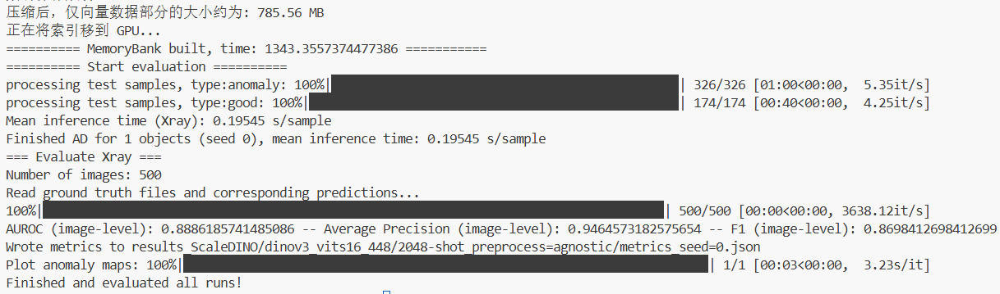

# DINOv3 蒸馏模型对比实验

**经过多轮多样本、多分辨率的比较得出，各个蒸馏模型的参数量并不会与最后识别性能成正比，因此用最小的 dinov3_vits16 即可.**

由于显存限制，模型最多提取 1024 张图片, 最后在大小为 500 的测试集上测试结果**准确率最高 94.9%**. 与 DinoV2 相比提高并不明显。

**实验详细结论见报告末尾。**

# 突破显存的限制

由于显存的限制，所以无法处理更多的图片，因此另辟蹊径，找到了两种可行方法：Coreset 提取和 faiss 索引压缩。

## Coreset

* 从一个空的核心集（coreset）开始。
* 在完整的特征库中找到与当前核心集中任何特征**距离最远**的那个特征。
* 将这个“最孤立”的特征添加到核心集中。
* 重复这个过程，总是添加那个能够最好地覆盖代表性不足区域的特征，直到核心集达到所需的大小（例如，原始大小的1%）。

提取 Coreset 过程时间缓慢, 而且用不了 faiss 加速，因为 faiss 在 gpu 上运行限定了搜索个数不超过 4096，而计算 coreset 的过程中，要比较的特征数量高达数百万

因此只能采用普通的 pytorch 并行运算加速。

**最后可以将 memorybank 大小压缩原来的 10%，其中压缩率是一个超参数，根据模型性能和内存大小更改。**

由于程序存在一个 bug，本周还未来得及测试最终结果。

## faiss 索引压缩

### **核心算法思想**

**量化索引结构**：

使用 `IndexIVFPQ`（倒排乘积量化索引）

**粗量化（IVF）**：

通过 `nlist=4096`个聚类中心将向量空间分块，减少搜索范围。

**细量化（PQ）**：

将高维向量（维度 `d`）切分为 `m=48`个子向量，每个子向量用 `bits=8`（256个码字）量化，大幅压缩存储。

第一步：向量切分 (Vector Splitting)

将一个高维向量切分成多段 **子向量 (sub-vectors)** 。

假设我们有一个 **D** 维的向量 **x**。我们可以把它切分成 **M** 段，每段的维度是 **D**/**M**。

第二步：子量化 (Sub-Quantization)

现在不直接对整个128维向量做量化，而是 **对每一段子向量独立地进行量化** 。

为每一段子向量空间，我们都训练一个**独立的、小型的**码本。这个码本就是所谓的 **子码本** ，而负责对这段子向量进行量化的过程单元，就是 **子量化器** 。

**索引训练**：

随机采样25%数据（`M//4`）训练量化器，学习数据分布。

**分批构建索引**：

避免内存溢出，分批次（每批10万）将向量添加到索引。

**GPU加速搜索**

* **索引迁移至GPU**：通过 `faiss.index_cpu_to_gpu`将CPU索引转移到GPU。
* **FP16优化**：启用 `useFloat16LookupTables`，利用半精度浮点数加速距离计算。
* **动态搜索范围**：设置 `nprobe=128`，搜索时检查128个最近聚类中心，平衡精度与速度。

**faiss 索引压缩后，程序可以处理 2048 张以上的图片，原始数据大小 > 20 GB，压缩仅仅 785.56 MB 而且模型性能准确率依然有 94.6%，调整超参数可能可以提高模型性能，这个还待继续测试。**

最后是不同模型的预测结果：

# DINOv3_vits16

## 128 样本，700分辨率

## 512 样本

## 768 shots

## 1024 shots， 364分辨率

# DINOv3_vitb16

## 64 样本（混杂了一些未预处理的图片）

## 64样本

## 128 样本（分辨率560）

## 256 样本（混杂了一些未预处理的图片）

## 256 样本

# 512 样本，378 分辨率

# DINOv3_Vitl16

## 64 样本

## 128样本

# DINOv3_convnext_base

## 128 样本，560 分辨率

## 512 样本，630 分辨率

## 512 样本，560 分辨率

# dino_convnext_tiny

## 768

## 1280

