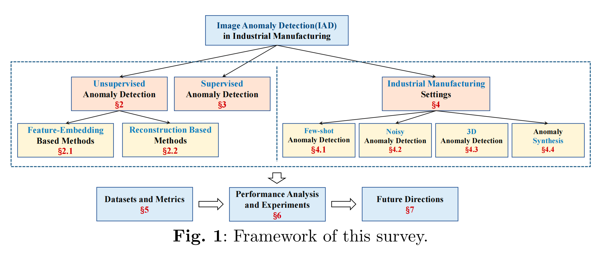
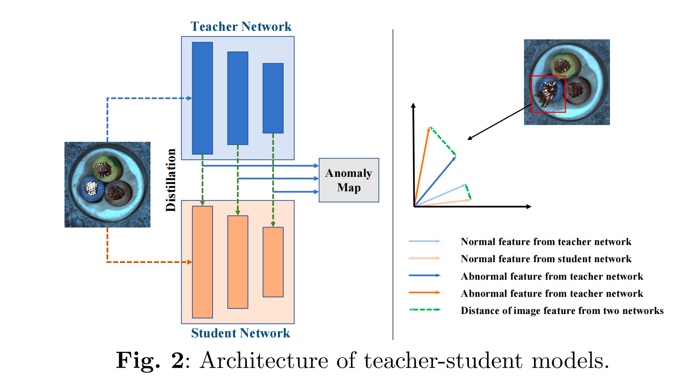
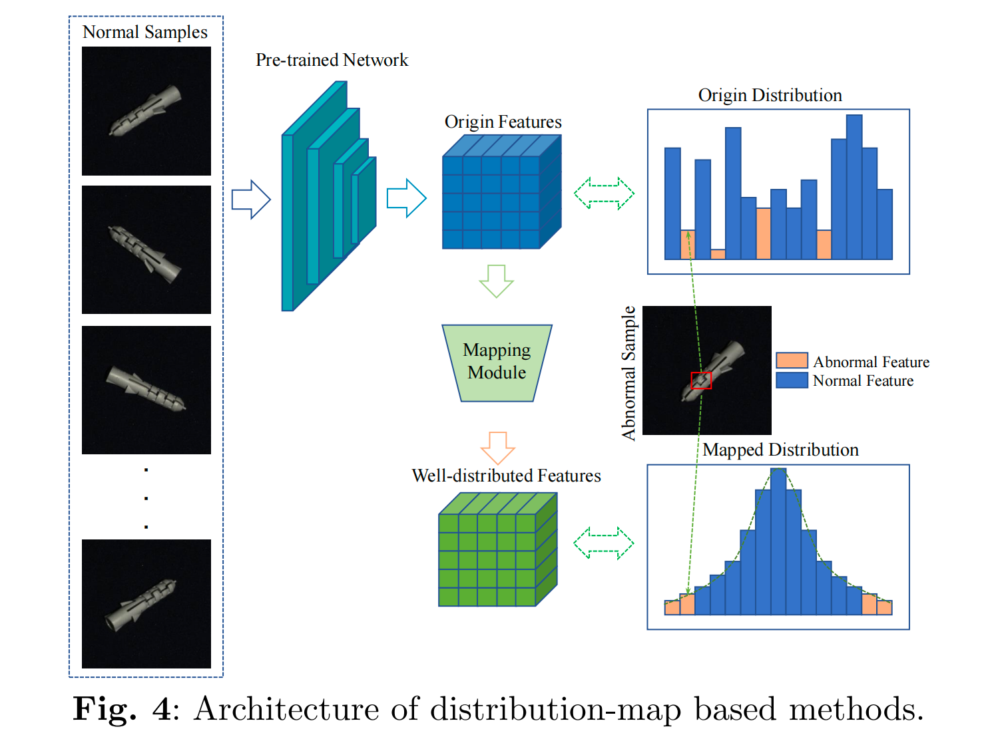
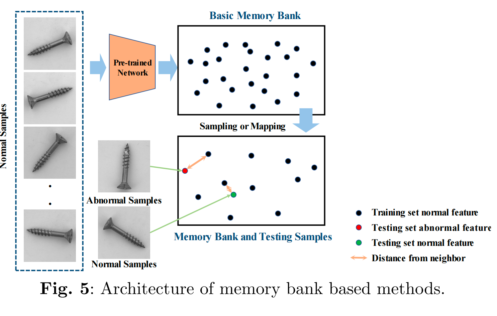

# Unsupervised AD

AD in industrial images is a subset of problems of OOD, which is a broader term for identifying data poins coming from a different distribution than the one the model is trained on.

## Feature-embedding based Methods

### Teacher-Student architecture

**教师模型：**

在一个大型数据集上预训练好的模型，参数固定不变

**学生模型：**

与教师模型结构相似，但更轻量，它用于学习教师提取特征。

**训练阶段：**

训练数据全部都是正常的图像。

输入一张图像，教师会输出一张特征图，训练的目标是让学生模型输出的特征图与教师相似。

**推理阶段：**

当输入正常图像时，学生生成的特征图和教师生成的会很相似。

当输入异常图像时，由于学生没有学习过，输出的特征图与教师生成的会有很大差异。

然后将学生模型输出的特征图和教师输出的特征图进行比较，得到一个“异常得分图"（Anomaly Map）。

差异越大的地方，异常得分越高。将差异图缩放到与原图同样的尺寸，就能得到清楚知道图片哪一个部位得分最高，从而实现对异常区域的精确定位。

### One-class Classification

模型把异常鉴别当成一个特殊的分类任务。

**训练阶段：**

## SVDD

## distribution-based methods

## Memory Bank

